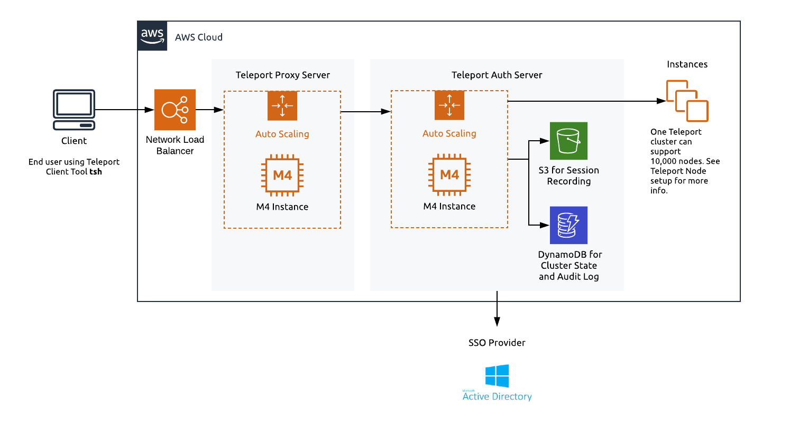

# Setting up and running Teleport OSS on AWS

## Introduction 

This guide will cover how to setup, configure and run Teleport on [AWS](https://aws.amazon.com/). 
It provides a high level introduction to the AWS services used to setup HA Teleport,
options to configure Teleport and an end user guide. 


## High Level Concepts


 
### AWS Services used for a HA Teleport Setup

- EC2 
- DynamoDB
- S3
- Route53 
- ELB
- IAM 
- 509x cert (AMC? or other)

We recommend creating a HA deployment of Teleport. In HA mode DynamoDB and S3 become
the store of state and the audit logs. 


#### EC2 / Autoscale
To run Teleport in a HA configuration we recommend using M8 ? instances and it's best
practice to separate the proxy and authentication server, creating auto-scale groups 
for both machines. We've a range of AMIs that have Teleport already built in it. 
Instructions on using these [AMIs are below](#).

#### DynamoDB
DynamoDB is a xXx database. For large clusters you can provision usage but for smaller 
deployments you can leverage DynamoDBs auto-scale. Teleport 4.0 leverages DynamoDB 
streaming feature. When turning this on, you'll need to specify `New Image` from
the streaming options. Teleport will store the audit log, and cluster state?? 


https://github.com/gravitational/teleport/issues/2430

#### S3 
S3 is a xXx. In this setup of Teleport S3 will be the store of recorded sessions. 
In this setup 

ADD https://aws.amazon.com/about-aws/whats-new/2018/11/s3-object-lock/

#### Route53
Route53 is a highly available Domain Name System (DNS) provided by AWS. It'll be 
needed to setup a URL for the proxy, we recommend using a sub-domain. e.g. 
`teleport.acmeinc.com`

#### ELB: Network Load Balancer
AWS provides many different load balancers. To setup Teleport, we recommend 
using a Network Load Balancer.  Network Load Balancers provides TLS for the Teleport 
proxy and provides the TCP connections needed for Teleport proxy SSH connections. 

#### IAM
IAM is the recommend tool for creating service access. This guide will follow the 
best practice of 'least privilege ?', 

#### 509x cert / TLS Certs
Teleport has a range of certificates that do different things and it can be little 
confusing when first setting up Teleport. 

- TLS Cert: Used to provide SSL for the proxy.
- SSL Certs: Created and self signed by the authentication server and given to machines
- XXX certs? 

## Setting up a HA Teleport Cluster
Teleport config based setup offers a wide range of customization for customers. 
This guide offers a range of setup options for AWS. If you have a very large accounts,
multiple accounts, or over 10k users we would recommend getting in touch. We are
more than happy to help you architect, setup and deploy Teleport into your environment.

We have these options for you. 
- Using our AMI
- Building your own base image ( manual )
- Deploying with Cloudformation
- Deploying with Terraform 

### Using AMIs
( INSERT YOKE HERE )

### Building your own base image

### Deploying with Cloudformation

### Deploying with Terraform

## Adding your AWS fleet to Teleport. 
Best practices
- Turn off SSH / or setup in Proxy mode.
- How to build 

### Installing Teleport to EC2 Nodes
? Using 

### Generating labels from AWS tags

```bash
#!/bin/bash

LOCAL_IP=`curl --silent --fail --show-error http://169.254.169.254/latest/meta-data/local-ipv4`
sed -ri "s/.*public_addr.*/    public_addr: ${LOCAL_IP}/" /etc/teleport/teleport.yaml

EXTERNAL_IP=`curl --silent --fail --show-error http://169.254.169.254/latest/meta-data/public-ipv4`
if [ $? -eq 0 ]
then
  sed -ri "s/.*nodename.*/    nodename: ${EXTERNAL_IP}/" /etc/teleport/teleport.yaml
else
  sed -ri "s/.*nodename.*/    nodename: private-${LOCAL_IP}/" /etc/teleport/teleport.yaml
  sed -ri "s/.*\[curl, \"http:\/\/169.254.169.254\/latest\/meta-data\/public-ipv4\"\].*/        command: \[echo, \"n\/a\"\]/" /etc/teleport/teleport.yaml
fi
```

and in teleport.yaml I had:

```yaml
    commands:
      - name: arch
        command: [uname, -p]
        period: 1h0m0s
      - name: kernel
        command: [uname, -r]
        period: 1h0m0s
      - name: uptime
        command: [uptime, -p]
        period: 1h0m0s
      - name: internal
        command: [curl, "http://169.254.169.254/latest/meta-data/local-ipv4"]
        period: 1h0m0s
      - name: external
        command: [curl, "http://169.254.169.254/latest/meta-data/public-ipv4"]
        period: 1h0m0s
```

https://docs.aws.amazon.com/AWSEC2/latest/UserGuide/ec2-instance-metadata.html 
^ looks like it can be done with CLI 

TODO https://github.com/gravitational/teleport/issues/1175 
 https://github.com/gravitational/teleport/issues/1346 

### Using Teleport with EKS
??

### Using Teleport with Kubernetes running on AWS


### Adding Labels to Teleport Nodes

